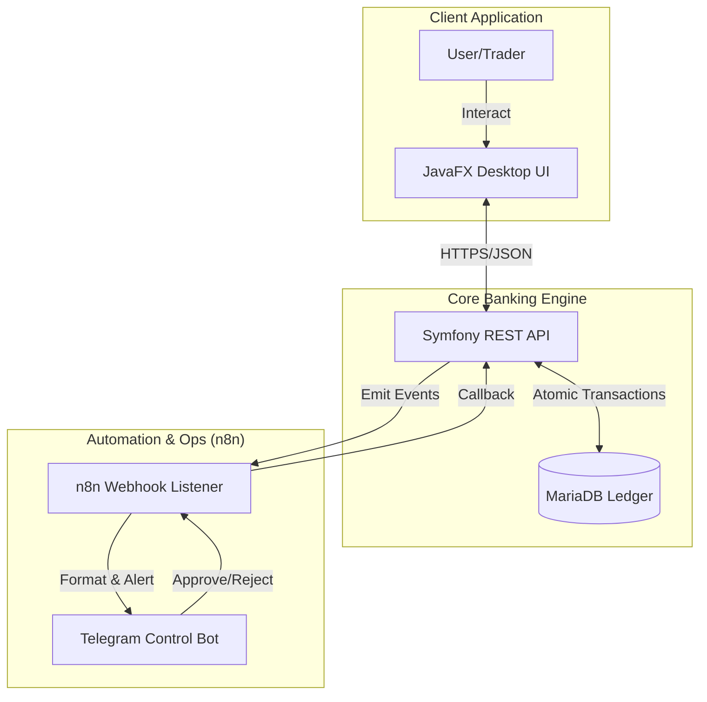

# 🏦 FinHub-TN (Escrow Engine)

**A secure, blockchain-inspired escrow & trading platform.**

 

## 🌟 Architecture & Engineering Concept

**FinHub-TN** is a distributed fintech architecture designed to facilitate secure, trustless peer-to-peer transactions through an automated escrow system.

**The Engineering Challenge:** Financial platforms require absolute atomicity (no partial transactions) and real-time operator alerts without coupling the core ledger to notification services.
**The Solution:** I decoupled the backend (Symfony REST API) from the frontend (JavaFX) and integrated an event-driven automation layer using self-hosted **n8n**. Webhooks trigger a custom **Telegram Bot** that allows administrators to remotely control wallets and monitor transactions.

---

## 🏗️ System Architecture

---

## ✨ Enterprise-Grade Features

- **🔐 Atomic Escrow Workflows:** Funds are cryptographically locked in a digital vault until multi-party validation is received, preventing race conditions or double-spending.
- **🤖 Automated Telegram Ops:** Remote wallet control and real-time transaction approval flows handled entirely through a Telegram bot via `n8n` webhooks.
- **🏛️ Decoupled Architecture:** Strict separation between the Front Office (trading/UI) and Back Office (administration/ledger).
- **📈 Smart Trading Support:** Basic AI-assisted support integrations for users navigating the trading platform.

---

## 🛠️ Technology Stack

- **Client Terminal:** Java, JavaFX (Desktop Client)
- **Core Ledger API:** PHP, Symfony Framework
- **Database:** MariaDB / MySQL (ACID Compliant)
- **Orchestration:** n8n (Webhooks & Event Routing)
- **Ops:** Telegram API

---

  <i>Built to demonstrate high-security financial systems and event-driven architecture.</i>

